# AWS DevOps Engineer Intern Assignment

## Candidate Details

| Field | Details |
|-------|---------|
| **Name** | Chittiboina Siva Narasimhulu |
| **College** | Rajiv Gandhi University of Knowledge Technologies (RGUKT) |
| **Branch** | Computer Science and Engineering |
| **Email** | narasimhasl61@gmail.com |
| **Date** | 09-07-2026 |

---

# Assignment Objective

Deploy a simple website on an AWS EC2 Ubuntu instance using the Nginx web server and document the complete deployment process.

---

# Technologies Used

- Amazon EC2
- Ubuntu 24.04 LTS
- Nginx
- Linux
- HTML5
- Git
- GitHub
- Docker
- Shell Scripting

---

# AWS Services Used

- Amazon EC2
- Security Groups

---

# Project Architecture

```
Internet
    │
    ▼
Public IP
    │
    ▼
AWS Security Group
 ├── Port 22 (SSH)
 └── Port 80 (HTTP)
    │
    ▼
Ubuntu EC2 Instance
    │
    ▼
Nginx Web Server
    │
    ▼
Static HTML Website
```

---

# Task 1 – Create an AWS EC2 Instance

## Steps Performed

- Logged into AWS Console.
- Opened EC2 Dashboard.
- Launched Ubuntu 24.04 LTS instance.
- Created a new Key Pair.
- Configured Security Group.
- Allowed inbound ports:
  - SSH (22)
  - HTTP (80)
- Connected to EC2 using SSH.

## SSH Command

```bash
ssh -i "NEW.pem" ubuntu@52.66.221.35
```

## Screenshots

### EC2 Dashboard

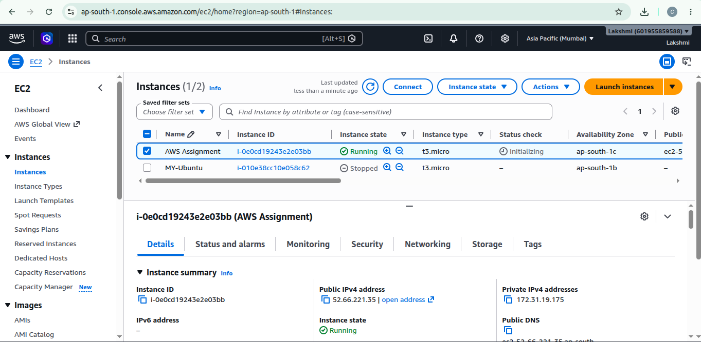

### Security Group

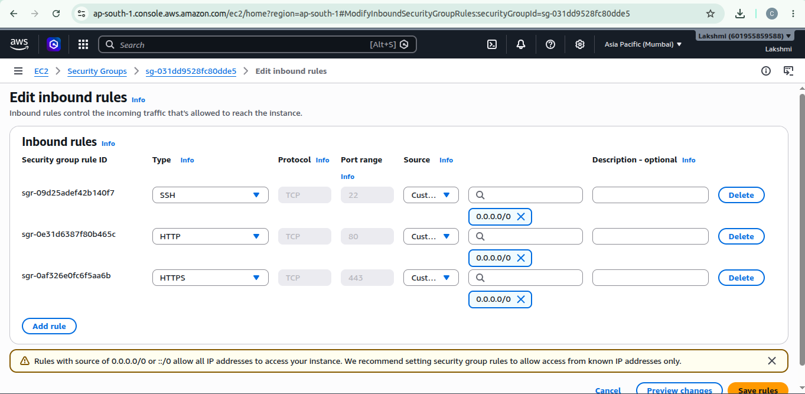

### SSH Login

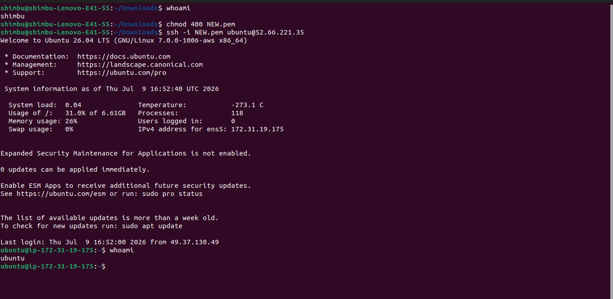

---

# Task 2 – Linux Basics

## Update System

```bash
sudo apt update
sudo apt upgrade -y
```

### Screenshot

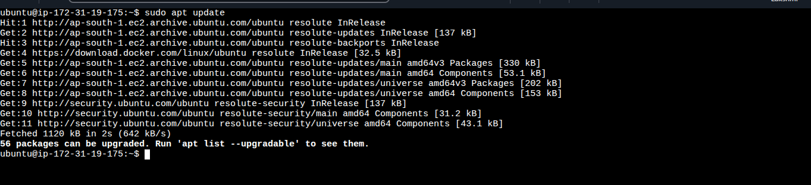

---

## Install Nginx

```bash
sudo apt install nginx -y
```

### Screenshot

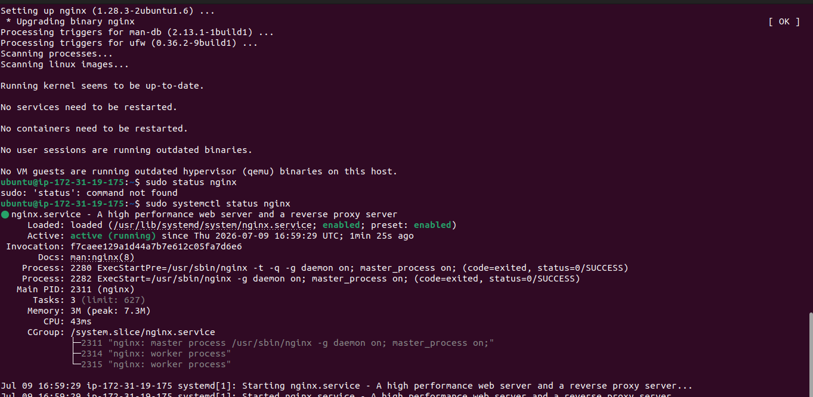

---

## Check Nginx Status

```bash
sudo systemctl status nginx
```

### Screenshot

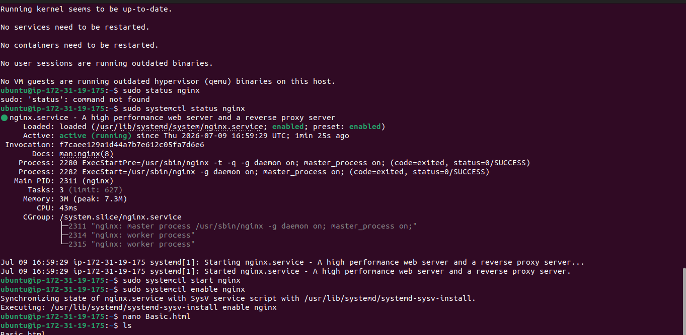

---

## Restart Nginx

```bash
sudo systemctl restart nginx
```

---

## Check Disk Usage

```bash
df -h
```

### Screenshot

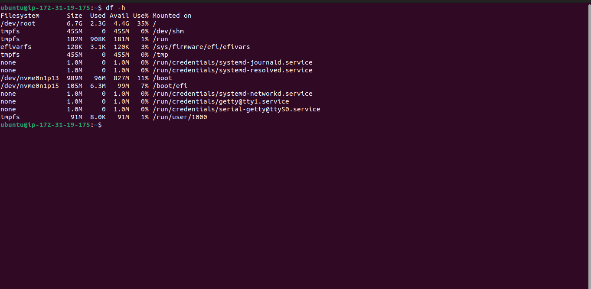

---

## Check Memory Usage

```bash
free -h
```

### Screenshot

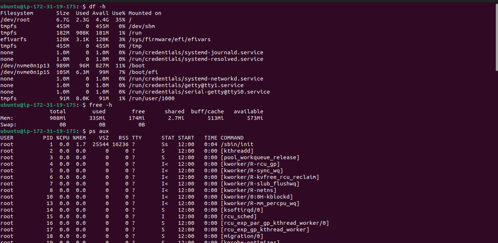

---

## Running Processes

```bash
ps aux
```

or

```bash
top
```

### Screenshot


---

# Task 3 – Host a Simple Website

Created a basic HTML webpage containing:

- Name
- College
- Branch
- Email
- Current Date

## HTML File Location

```bash
/var/www/html/Basic.html
```

## Edit HTML

```bash
sudo nano /var/www/html/Basic.html
```

## Restart Nginx

```bash
sudo systemctl restart nginx
```

## Website URL

```
http://13.202.245.239/Basic.html
```

## Screenshots

### HTML File

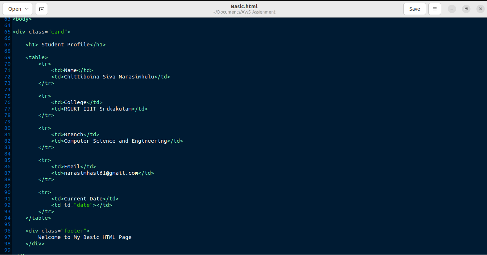

### Website Output

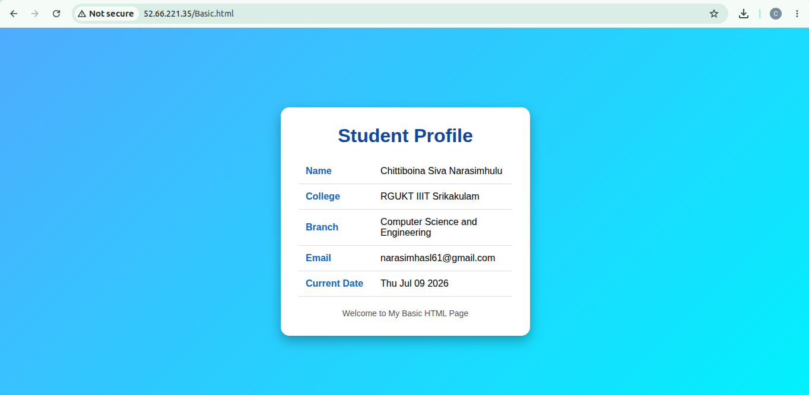

---

# Task 4 – Git & GitHub

## Initialize Repository

```bash
git init
```

## Add Files

```bash
git add .
```

## Commit

```bash
git commit -m "Initial Commit"
```

## Add Remote

```bash
git remote add origin https://github.com/sivanarasimhulu21/AWS-Assignment.git
```

## Push Repository

```bash
git push -u origin main
```


---

# Repository Structure

```
AWS-Assignment/
│
├── README.md
├── Basic.html
├── shell.sh
│
└── screenshots/
    ├── 01-ec2-dashboard.png
    ├── 02-security-group.png
    ├── 03-ssh-login.png
    ├── 04-system-update.png
    ├── 05-nginx-install.png
    ├── 06-nginx-status.png
    ├── 07-disk-usage.png
    ├── 08-memory-usage.png
    ├── 09-processes.png
    ├── 10-html-page.png
    ├── 11-browser-output.png
    ├── 12-docker-install.png
    ├── 13-docker-hello-world.png
    ├── 14-shell-script.png
    └── 15-shell-script-output.png
```

---

# Task 5 – Documentation

The PDF report includes:

- AWS Services Used
- EC2 Instance Setup
- Security Groups
- Linux Commands Used
- Nginx Installation
- Website Deployment
- GitHub Repository
- Problems Faced
- Learnings
- Time Taken

---

# Linux Commands Used

## Update Packages

```bash
sudo apt update
sudo apt upgrade -y
```

## Install Nginx

```bash
sudo apt install nginx -y
```

## Start Nginx

```bash
sudo systemctl start nginx
```

## Check Nginx Status

```bash
sudo systemctl status nginx
```

## Restart Nginx

```bash
sudo systemctl restart nginx
```

## Disk Usage

```bash
df -h
```

## Memory Usage

```bash
free -h
```

## Running Processes

```bash
ps aux
```

## Edit Website

```bash
sudo nano /var/www/html/Basic.html
```

---

# Bonus Task 1 – Install Docker

## Install Docker

```bash
sudo apt update
sudo apt install docker.io -y
```

## Verify Docker

```bash
docker --version
```

## Run Hello World Container

```bash
sudo docker run hello-world
```

## Screenshots

### Docker Installation

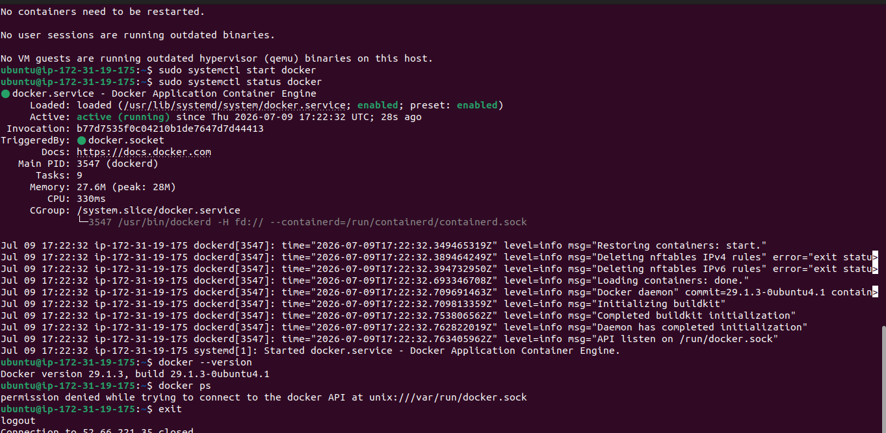

### Docker Hello World

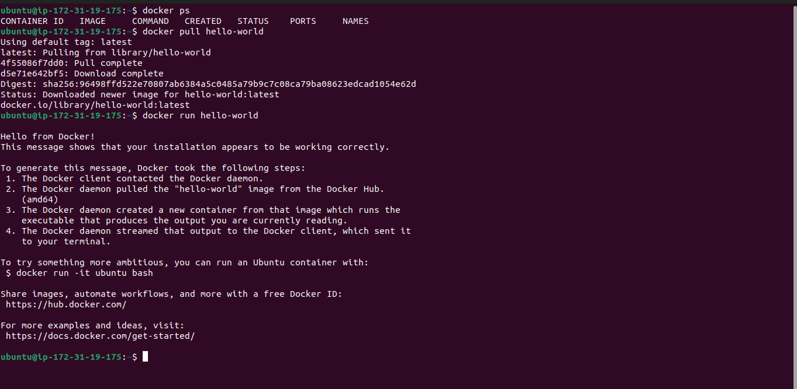

---

# Bonus Task 2 – Shell Script

## shell.sh

```bash
#!/bin/bash

# Restart Nginx service

echo "Restarting Nginx..."

sudo systemctl restart nginx

if [ $? -eq 0 ]; then
    echo "Nginx restarted successfully."
else
    echo "Failed to restart Nginx."
fi
```

## Make Executable

```bash
chmod +x shell.sh
```

## Execute Script

```bash
./shell.sh
```

## Screenshots

### Shell Script Creation

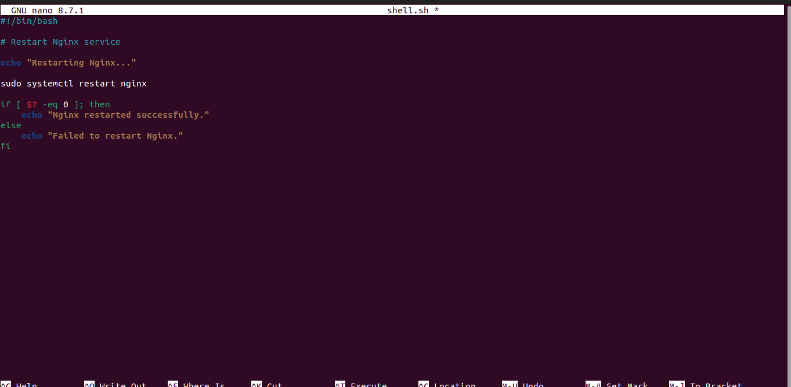

### Shell Script Output

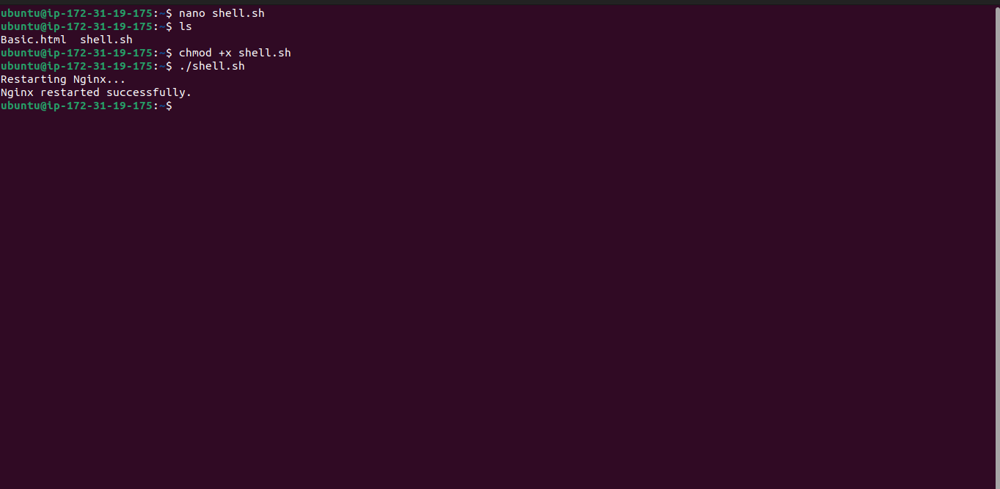

---

# Problems Faced

- SSH permission denied while connecting to EC2.
- GitHub authentication issue while pushing repository.
- Replacing the default Nginx page.
- File permission issues while editing `/var/www/html/index.html`.

---

# Learnings

- Launching and managing AWS EC2 instances.
- Configuring Security Groups.
- Connecting to EC2 using SSH.
- Installing and managing Nginx.
- Deploying a static website.
- Linux command-line operations.
- Git and GitHub workflow.
- Installing and using Docker.
- Writing and executing shell scripts.
- Basic DevOps deployment practices.

---
# Conclusion

Successfully launched an Ubuntu EC2 instance on AWS, configured Security Groups, installed and managed Nginx, deployed a static HTML website, uploaded the project to GitHub, installed Docker and executed the `hello-world` container, and automated Nginx restart using a shell script. This assignment provided practical hands-on experience with AWS, Linux administration, Docker, Git, GitHub, and basic DevOps workflows.

---
